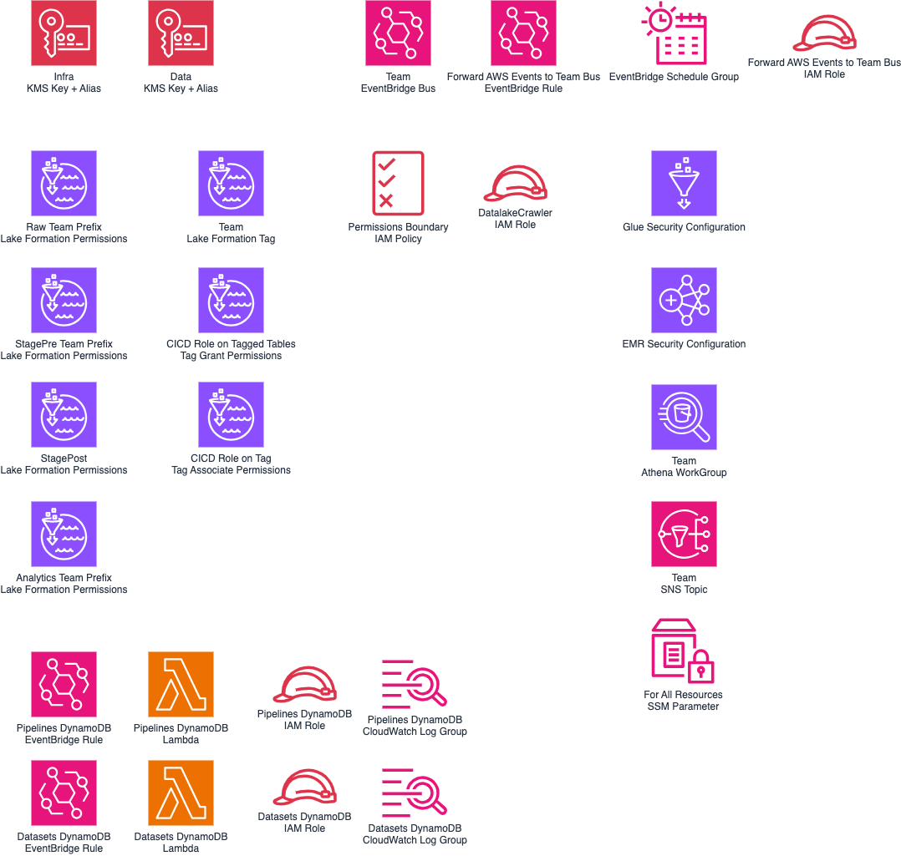

# sdlf-team

!!! note
    `sdlf-team` is defined in the [sdlf-team](https://github.com/awslabs/aws-serverless-data-lake-framework/tree/main/sdlf-team) folder of the [SDLF repository](https://github.com/awslabs/aws-serverless-data-lake-framework).

## Infrastructure

{: style="width:80%"}

A team is a group of individuals that wish to onboard into the data lake. It can be a pizza team of developers or an entire Business Unit such as the marketing or finance department. A team is responsible for their data pipelines, datasets and repositories which are unique to the team and completely segregated from others. Teams are also isolated from both an operational and security standpoint through least-privilege IAM policies.

As such `sdlf-team` is mostly about permissions.

The two `Pipelines` and `Datasets` Lambda functions (and related resources) are used to populate the DynamoDB tables `octagon-Pipelines-{environment}` and `octagon-Datasets-{environment}` from `sdlf-foundations`.

SSM parameters holding names or ARNs are created for all resources that may be used by other modules.

!!! warning
    The data lake admin team should be the only one with write access to the `sdlf-team` code base, as it is used to restrict permissions given to team members.

## Usage

### CloudFormation with [sdlf-cicd](cicd.md)

Read the official [SDLF workshop](https://sdlf.workshop.aws/) for an end-to-end deployment example.

```
rExample:
    Type: awslabs::sdlf::team::MODULE
    Properties:
        pPipelineReference: !Ref pPipelineReference
        pTeamName: industry
        pEnvironment: dev
        pSNSNotificationsEmail: nobody@amazon.com
```

## Interface

Interfacing with other modules is done through [SSM Parameters](https://docs.aws.amazon.com/systems-manager/latest/userguide/systems-manager-parameter-store.html). `sdlf-team` publishes the following parameters:

| SSM Parameter                                     | Description                                                     | Comment                                      |
| ------------------------------------------------- | --------------------------------------------------------------- | -------------------------------------------- |
| `/SDLF/Athena/{team}/WorkgroupName`               | Team Athena workgroup name                                      |                                              |
| `/SDLF/EventBridge/{team}/EventBusName`           | Name of the team dedicated event bus                            |                                              |
| `/SDLF/EventBridge/{team}/ScheduleGroupName`      | Name of the team dedicated schedule group                       |                                              |
| `/SDLF/Glue/${pTeamName}/SecurityConfigurationId` | Glue security configuration name                                |                                              |
| `/SDLF/IAM/${pTeamName}/CrawlerRoleArn`           | IAM Role ARN for Glue crawlers                                  |                                              |
| `/SDLF/IAM/${pTeamName}/TeamPermissionsBoundary`  | ARN of the permissions boundary IAM Managed policy for the team |                                              |
| `/SDLF/KMS/${pTeamName}/DataKeyId`                | ARN of the team KMS data key                                    |                                              |
| `/SDLF/KMS/${pTeamName}/InfraKeyId`               | ARN of the team KMS infrastructure key                          |                                              |
| `/SDLF/SNS/${pTeamName}/Notifications`            | ARN of the team-specific SNS Topic                              |                                              |
